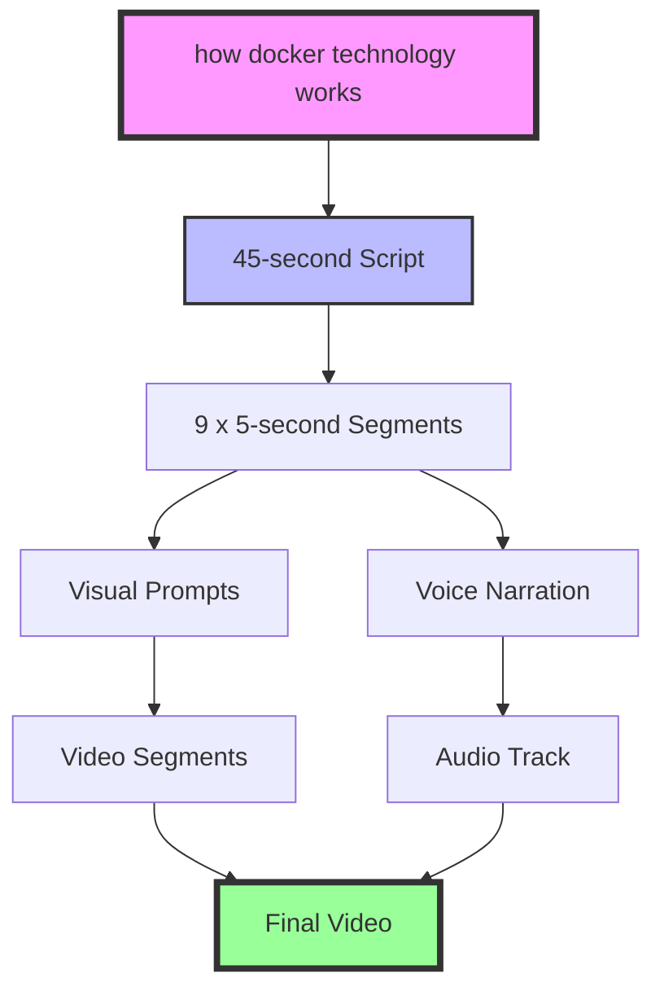

# Data Flow: How Your Topic Becomes a Video

This document explains exactly how prompt2production transforms a simple topic like "how docker technology works" into a complete 45-second explainer video.

## 🎯 Overview



## 📋 Pipeline Stages

### 1. **Topic Input**
**Command:** `python create_video.py "how docker technology works"`

**What happens:** Your topic is parsed and configured:
```json
{
  "technical_topic": "how docker technology works",
  "total_duration": 45,
  "segment_duration": 5,
  "segments": 9,
  "voice_style": "american-male"
}
```

---

### 2. **Cohesive Script Generation** 
**File:** [`core/chains/cohesive_script_builder.py`](core/chains/cohesive_script_builder.py)  
**AI Model:** AWS Bedrock/Nova LLM

**Process:**
1. Calculates target word count (45 seconds × 150 wpm ÷ 60 = ~113 words)
2. Generates a complete, flowing explanation
3. Ensures natural progression from basic to advanced concepts

**Example Output:**
```
Docker is a technology that packages applications into containers. 
Think of it like shipping containers for software. Each container 
includes everything the app needs to run: code, libraries, and settings. 
This makes applications portable across different systems. Developers 
can build once and run anywhere. Docker uses layers to make containers 
efficient. Multiple containers can share the same base layers. This 
revolutionized how we deploy software, making cloud computing more 
accessible to everyone.
```

---

### 3. **Smart Script Segmentation**
**Function:** `segment_script()` in [`cohesive_script_builder.py`](core/chains/cohesive_script_builder.py#L56)

**Process:**
1. Splits script at sentence boundaries
2. Groups sentences to fit ~5-second segments
3. Validates timing (12-15 words per segment)

**Output:**
```json
[
  {
    "index": 1,
    "text": "Docker is a technology that packages applications into containers.",
    "words": 9,
    "duration": 5,
    "start_time": 0,
    "end_time": 5
  },
  {
    "index": 2,
    "text": "Think of it like shipping containers for software.",
    "words": 8,
    "duration": 5,
    "start_time": 5,
    "end_time": 10
  },
  // ... 7 more segments
]
```

---

### 4. **Visual Prompt Generation**
**File:** [`core/chains/segment_visualizer.py`](core/chains/segment_visualizer.py)  
**AI Model:** AWS Bedrock/Nova LLM

**Process:**
1. Creates consistent visual theme for entire video
2. Generates specific visuals for each segment
3. Ensures visual continuity between segments

**Example Segment Visual:**
```
Segment 1: "Docker is a technology that packages applications into containers."
Visual: Wide shot of a modern tech workspace transitioning to animated 
        software components being neatly packed into a glowing blue container.
        Smooth, clean animation style with tech-blue color palette.
```

---

### 5. **Voice Synthesis**
**File:** [`core/chains/narrator_voice_gen.py`](core/chains/narrator_voice_gen.py)  
**AI Model:** ElevenLabs Text-to-Speech

**Process:**
1. Takes complete script (not segments)
2. Synthesizes as one continuous narration
3. Exports as single MP3 file

**Output:** `output/video_*/final_voiceover.mp3` (45 seconds)

---

### 6. **Video Generation**
**File:** [`core/services/replicate_api.py`](core/services/replicate_api.py)  
**AI Model:** Google Veo-3 (via Replicate)

**Process:**
1. Generates 9 separate 5-second video clips
2. Each clip matches its segment's visual prompt
3. Maintains consistent style across all clips

**Output:** 
```
output/video_*/segments/
├── segment_01.mp4 (5 seconds)
├── segment_02.mp4 (5 seconds)
├── ...
└── segment_09.mp4 (5 seconds)
```

---

### 7. **Video Assembly**
**File:** [`core/services/video_composer.py`](core/services/video_composer.py)  
**Tool:** FFmpeg

**Process:**
1. Concatenates 9 video segments in order
2. Overlays the complete voice narration
3. Ensures perfect audio-video synchronization

**FFmpeg Commands:**
```bash
# Step 1: Concatenate segments
ffmpeg -f concat -i segments.txt -c copy concatenated.mp4

# Step 2: Add narration
ffmpeg -i concatenated.mp4 -i narration.mp3 -c:v copy -c:a aac final_video.mp4
```

**Final Output:** `output/video_*/final_video.mp4`

---

## 📁 Output Files

```
output/video_20240115_143022/
├── project_config.json      # Configuration used
├── full_script.txt          # Complete narration text
├── segment_breakdown.txt    # Timing breakdown
├── storyboard.md           # Visual descriptions
├── metadata.json           # Video statistics
├── final_voiceover.mp3     # Complete narration audio
├── segments/               # Individual video clips
│   ├── segment_01.mp4
│   ├── segment_02.mp4
│   └── ...
└── final_video.mp4         # ✨ Your finished video!
```

---

## 🔧 Configuration

All timing and quality settings come from [`config.yaml`](config.yaml):

```yaml
pipeline:
  video:
    total_duration: 45      # Total video length
    segment_duration: 5     # Each scene length
    segments: 9            # Number of scenes
  timing:
    words_per_minute: 150   # Natural speaking pace
    buffer_percentage: 0.9  # Safety margin
```

---

## 🎬 Example Timeline

Here's how "how docker technology works" breaks down:

| Time | Segment | Narration | Visual |
|------|---------|-----------|---------|
| 0:00-0:05 | 1 | "Docker is a technology that packages applications into containers." | Software components being packed into container |
| 0:05-0:10 | 2 | "Think of it like shipping containers for software." | Shipping port with containers transforming to code |
| 0:10-0:15 | 3 | "Each container includes everything the app needs to run." | X-ray view of container showing components |
| 0:15-0:20 | 4 | "This makes applications portable across different systems." | Container moving between different computers |
| 0:20-0:25 | 5 | "Developers can build once and run anywhere." | Developer working, app deploying to multiple platforms |
| 0:25-0:30 | 6 | "Docker uses layers to make containers efficient." | Animated layers stacking to form containers |
| 0:30-0:35 | 7 | "Multiple containers can share the same base layers." | Containers sharing common foundation layers |
| 0:35-0:40 | 8 | "This revolutionized how we deploy software." | Timeline showing before/after Docker impact |
| 0:40-0:45 | 9 | "Making cloud computing more accessible to everyone." | Cloud expanding to reach diverse users globally |

---

## 🚀 Performance

- **Script Generation:** ~2 seconds
- **Segmentation:** <1 second  
- **Visual Prompts:** ~3 seconds
- **Voice Synthesis:** ~5 seconds
- **Video Generation:** ~30 seconds (9 clips in parallel)
- **Assembly:** ~3 seconds

**Total:** ~45 seconds to create a 45-second video!